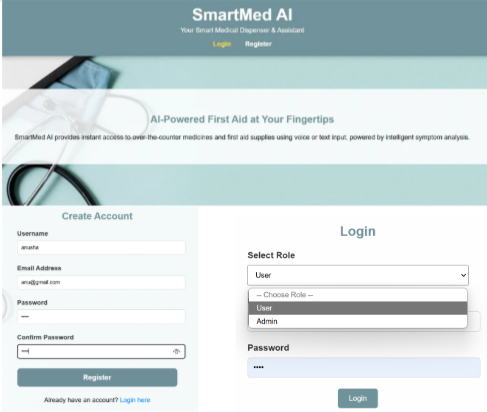
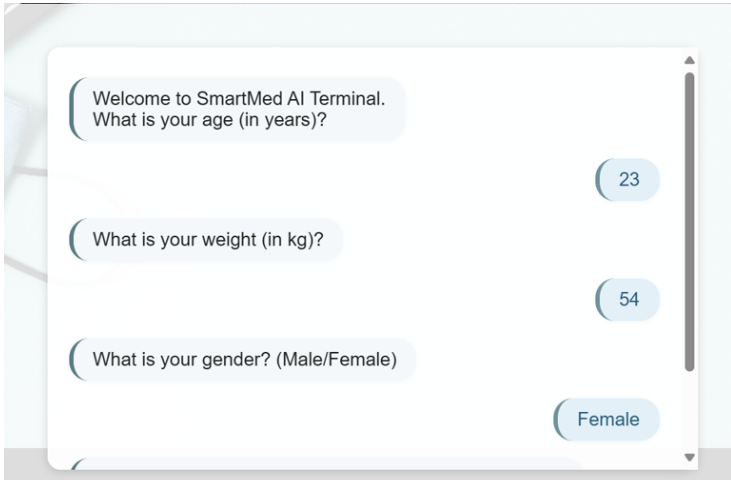
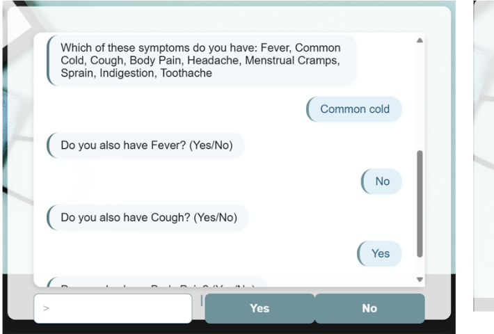
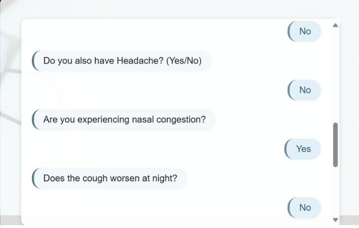
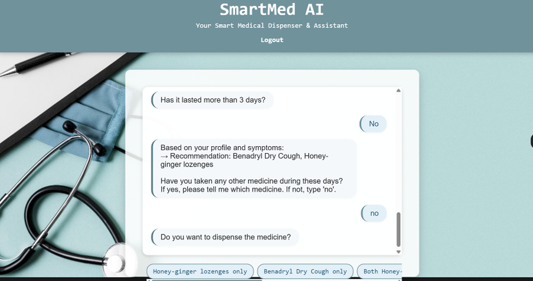
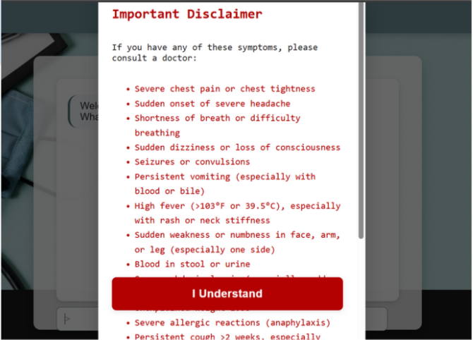
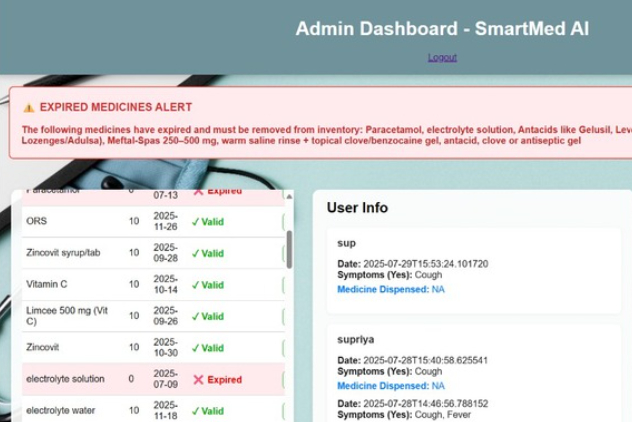

# SmartMed: AI-Based Medical Dispenser 🤖💊

## Overview
SmartMed is an AI-powered platform designed to analyze patient symptoms and provide data-driven, personalized recommendations for over-the-counter medications. It integrates patient demographics (age, weight, gender) and symptom patterns to deliver precise guidance while flagging serious conditions that require medical attention. 🩺

This project exemplifies the application of healthcare analytics, AI-driven decision support, and real-world biomedical data interpretation.

## Core Features
- **Patient Profile Analytics** – Secure registration and demographic-based data capture for personalized insights.  
- **Symptom-Driven AI Analysis** – Adaptive questioning to refine symptom understanding and improve recommendation accuracy.  
- **Medicine Recommendation Engine** – Suggests appropriate OTC medications and dosages based on patient data and clinical safety rules.  
- **Safety & Risk Alerts** – Highlights critical conditions requiring professional medical intervention.  
- **Smart Dispensing & Inventory Management** – Ensures correct medicine selection and real-time stock validation.  

## How It Works
**Patient Workflow:**  
1. Register and provide demographic details (age, weight, gender)  
2. Select primary symptom (e.g., fever, headache, cough)  
3. Respond to AI-guided follow-up questions  
4. Receive personalized medicine suggestions with dosage recommendations  
5. Confirm selection and dispense medication  

**Admin / Analytics Workflow:**  
1. Secure admin login to access dashboard  
2. Monitor medicine inventory and usage trends  
3. Analyze patient symptom data and system utilization patterns  
4. Generate insights to optimize dispensing protocols and improve patient safety  

## Results

## Relevance to Healthcare Analytics
- Demonstrates AI-driven clinical decision support  
- Enables analysis of symptom-medication patterns for population-level insights  
- Integrates predictive analytics with patient-specific safety rules  
- Offers a foundation for research in **personalized medicine, digital therapeutics, and bioinformatics-driven healthcare systems**  

